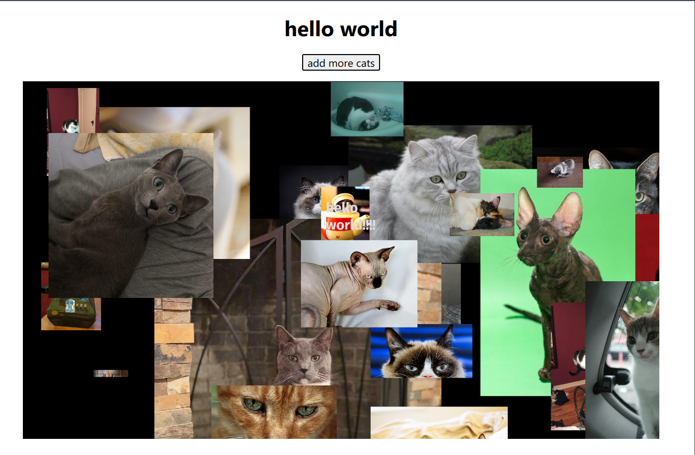

# hello coding club people

Discord bot version of the webserver

Mention the bot to receive an image of a cat



## but how does it work?

The cat image fetching is functionally the same as the webserver, but instead of opening one, we
connect to the discord API using `discord.js` and login as a bot.

If the bot is mentioned by a user, it will send back an embed of a cat.

## how to install

1. clone this repo (green button at the top) and checkout this branch (`discord`)
2. install dependencies: `yarn`
3. copy `.env.example` to `.env` and fill in the fields
   1. get a Discord bot token at <https://discord.com/developers>
   2. get a cat API key at <https://thecatapi.com>

your `.env` should look like this:

```sh
CAT_API_KEY='XXXXXXXX-XXXX-XXXX-XXXX-XXXXXXXXXXXX'
DISCORD_TOKEN='XXXXXXXXXXXXXXXXXXXXXXXXXX.XXXXX.XXXXXXXXXXXXXXXXXXXXXXXXXXX'
```

4. start the bot by either running `yarn dev` or `yarn build && yarn start`
   1. docker files availble: you can run `docker build .` to build an image and
      `docker run <image id>` to start it
